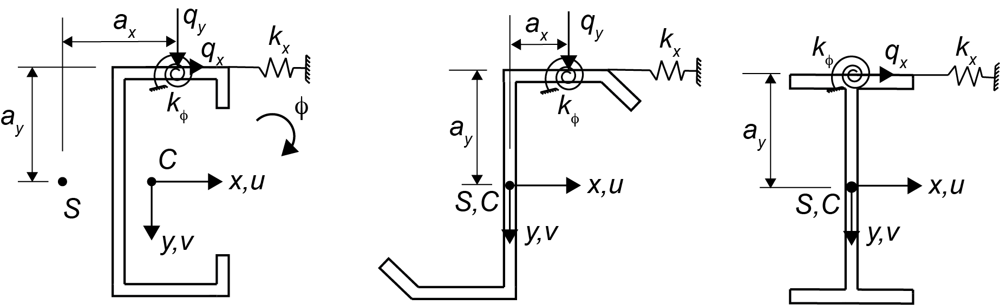

# Beam

Perform second order structural analysis of single or multi-span thin-walled beams with a uniform loading.   The location of the uniform loading on the cross-section (e.g., top of flange, bottom of flange, through the shear center) can be specified.  Lateral and vertical loads can be applied which can be convenient for considering roof slope. Continuous lateral and rotational springs are available to simulate attachment bracing.  

## Nomenclature

Here are some possible beam cross-section configurations.



## Example
Calculate the deflection of a 25 ft. simple span Z-section purlin.  Consistent units of kips and inches are used.  The purlin is loaded at the center of the top flange with a uniform downward gravity load. Continuous bracing from roof sheathing is provided as `kx=0.100 kips/in.\in.` and `kϕ=0.100 kip-in./rad/in.`.

```julia
using StructuresKit

#The beam line is discretized on a grid.
#Each row defines one segment of the beam span from left to right.

#MemberDefinitions defines the information about each beam segment.

#L dL SectionProperties MaterialProperties LoadLocation BracingProperties CrossSectionDimensions
MemberDefinitions = [(25*12, 6.0, 1, 1, 1, 1, 1)]

#location where u=v=ϕ=0
Supports = [0.0 25.0*12]

#end boundary conditions
#type=1 u''=v''=ϕ''=0 (simply supported), type=2 u'=v'=ϕ'=0  (fixed), type=3 u''=v''=ϕ''=u'''=v'''=ϕ'''=0 (free end, e.g., a cantilever)
EndBoundaryConditions = [1 1]

                      #Ix Iy Ixy J Cw
SectionProperties = [(9.18, 1.28, -2.47, 0.00159, 15.1)]

                          #E  ν
MaterialProperties = [(29500, 0.30)]

                        #ax         ay
LoadLocation = [((2.250-0.070/2)/2, 4.0)]

                      #kx  kϕ  
SpringStiffness = [(0.100, 0.100)]

             #qx   qy
UniformLoad=(0.0, 0.001)

z, u, v, ϕ, BeamProperties = PlautBeam.solve(MemberDefinitions, SectionProperties, MaterialProperties, LoadLocation, SpringStiffness, EndBoundaryConditions, Supports, UniformLoad)

#plot beam deformed shape
using Plots
plot(z, u)
plot(z, v)
plot(z, ϕ)

```
## Background
The theory and equations supporting this module are documented in:

 Plaut, R.H., Moen, C.D. (2020). ["Lateral-Torsional Deformations of C-Section and Z-Section Beams with Continuous Bracing."](https://cloud.aisc.org/SSRC/2020.html?_zs=X87We1&_zl=EMjo6)   Proceedings of the Annual Stability Conference, Structural Stability Research Council.

  Plaut, R.H., Moen, C.D. (2020). "Lateral-Torsional Deformations of Single-Span and Two-Span Thin-Walled Beams with Continuous Bracing." Journal of Constructional Steel Research.

## Numerical solution
Deformations `u`, `v`, and `ϕ` of the thin-walled beam are obtained with the solution of a system of ordinary differential equations.

Finite difference derivative operators are defined as a function of the deformations using [DiffEqOperators.jl](https://github.com/SciML/DiffEqOperators.jl), e.g., the fourth derivative of *u* with respect to *z*, `uzzzz=Azzzz*u`, and then with a uniform load *q* defined, the system of nonlinear equations are solved for `u`, `v`, and `ϕ` with [NLsolve.jl](https://github.com/JuliaNLSolvers/NLsolve.jl).

Boundary conditions for free ends, simply supported ends, and fixed ends are implemented with finite difference stencils calculated with the method described by [Souza].(https://cimec.org.ar/ojs/index.php/mc/article/view/2662 )

## Limitations
Cross-section deformation is not considered and so calculated displacements may be smaller than what would be predicted in an experiment.   Also small deformations are assumed, i.e., `1 + (u')2 ≈ 1, 1 + (v')2 ≈ 1, sinφ ≈ φ, and cos φ  ≈ 1`.

## Verification and testing log

### PlautBeamTest1.jl
Verify Julia solution against Mathematica solution from Example 2 Plaut, R.H., Moen, C.D.(2020). "Lateral-Torsional Deformations of C-Section and Z-Section Beams with Continuous Bracing".  Proceedings of the Structural Stability Research Council Annual Conference, Atlanta, Georgia.

Z-section, no slope, simple span
kϕ=300 N*mm/rad/mm, kx=0, gravity load

### PlautBeamTest2.jl
Verify Julia solution against Mathematica solution from
Example 2, Plaut, R.H., Moen, C.D.(2020). "Lateral-Torsional Deformations of Single-Span and Two-Span Thin-Walled Beams with Continuous Bracing". Journal of Constructional Steel Research.

Z-section, no slope, single span, fixed-fixed
kϕ=1500 N*mm/rad/mm, kx=0.1 N/mm^2, gravity load, q = 1 kN/m

Check against Figure 14 in the Plaut and Moen (2020) JCSR manuscript calculated with Mathematica.

### PlautBeamTest3.jl
Compare PlautBeam solution to LS-DYNA thin shell FEA solution.

The [LS-DYNA input file](/test/Beam/testfiles/PlautBeamTest3/SSRCExample2r6.k) is provided.

Example 2 Plaut, R.H., Moen, C.D.(2020). "Lateral-Torsional Deformations of C-Section and Z-Section Beams with Continuous Bracing".  Proceedings of the Structural Stability Research Council Annual Conference, Atlanta, Georgia.

Z-section, no slope, simple span, load is applied at ax=0, ay=0 to avoid cross-section deformation, kϕ=0 , kx=0, gravity load, q = 0.008 kN/m


### Tests needed
* roof slope (Julia vs. Mathematica)
* lateral spring (PlautBeam vs. thin shell FEA)
* rotational spring (PlautBeam vs. thin shell FEA)
* show when cross-sectional deformation causes significant error by varying thickness
