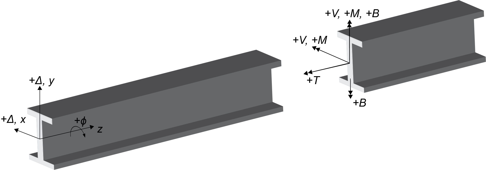

# InternalForces

## Usage
Calculate internal forces and moments from a structural member's deformed shape.

## Nomenclature

Positive deformations and twist are defined in the figure below. Positive internal moments, bimoment, and torsion follow the right hand rule.  



## Functions

`M = d2Δ/dz2*E*I`
```julia
M = moment(z, Δ, E, I)
```

`V = d3Δ/dz3*E*I`
```julia
V = shear(z, Δ, E, I)
```

`T = GJ*dϕ/dz - ECw*dϕ3/dz3`
```julia
T = torsion(z, ϕ, E, G, J, Cw)
```

`B = ECwd2ϕ/dz`
```julia
B = bimoment(z, ϕ, E, Cw)
```

## Example

Calculate the internal forces and moments for a 25 ft. simple span Z-section purlin.  Consistent units of kips and inches are used.  The purlin is loaded at the center of the top flange with a uniform downward gravity load.

```julia

using StructuresKit

#calculate beam deformed shape with PlautBeam

#L dL SectionProperties MaterialProperties LoadLocation BracingProperties CrossSectionDimensions
memberDefinitions = [(25*12, 6.0, 1, 1, 1, 1, 1)]

#location where u=v=ϕ=0
supports = [0.0 25.0*12]

#end boundary conditions
#type=1 u''=v''=ϕ''=0 (simply supported), type=2 u'=v'=ϕ'=0  (fixed), type=3 u''=v''=ϕ''=u'''=v'''=ϕ'''=0 (free end, e.g., a cantilever)
endBoundaryConditions = [1 1]

                      #Ix Iy Ixy J Cw
sectionProperties = [(9.18, 1.28, -2.47, 0.00159, 15.1)]

                          #E  ν
materialProperties = [(29500, 0.30)]

                        #ax         ay
loadLocation = [((2.250-0.070/2)/2, 4.0)]

                      #kx  kϕ
springStiffness = [(0.0, 0.0)]

             #qx   qy
uniformLoad=(0.0, 0.001)

z, u, v, ϕ, beamProperties = PlautBeam.solve(memberDefinitions, sectionProperties, materialProperties, loadLocation, springStiffness, endBoundaryConditions, supports, uniformLoad)


#note -u and -v below because PlautBeam positive deformation directions are reversed
Mxx = InternalForces.moment(z, -v, beamProperties.E, beamProperties.Ix)
Myy = InternalForces.moment(z, -u, beamProperties.E, beamProperties.Iy)
Vyy = InternalForces.shear(z, -v, beamProperties.E, beamProperties.Ix)
Vxx = InternalForces.shear(z, -u, beamProperties.E, beamProperties.Iy)
T = InternalForces.torsion(z, ϕ, beamProperties.E, beamProperties.G, beamProperties.J, beamProperties.Cw)
B = InternalForces.bimoment(z, ϕ, beamProperties.E, beamProperties.Cw)


#plot beam moment, shear, torsion, and bimoment

using Plots
plot(z, Mxx)
plot(z, Myy)
plot(z, Vyy)
plot(z, Vxx)
plot(z, T)
plot(z, B)

```

## Numerical solution
Internal forces and moments are calculated with finite difference derivative operators, e.g., `Mxx=Azz*v*E*I`.  Derivative operators are defined using [DiffEqOperators.jl](https://github.com/SciML/DiffEqOperators.jl).  

## Verification and testing log

### InternalForcesTest1.jl
Test moment and shear calculation for a simply-supported beam.

### InternalForcesTest2.jl
Test torsion calculation for a simply-supported beam with twist fixed warping free ends.
ax=1.0 in., offset uniform load

### InternalForcesTest3.jl
Test shear and moment calculations for a cantilever beam.

### InternalForcesTest4.jl
Test shear and moment calculations for a three span continuous beam.

### InternalForcesTest5.jl
Test bimoment calculation for a simple span beam.

### Tests needed
None at this time
